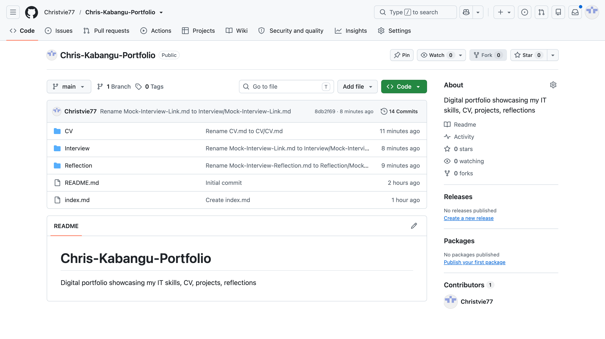
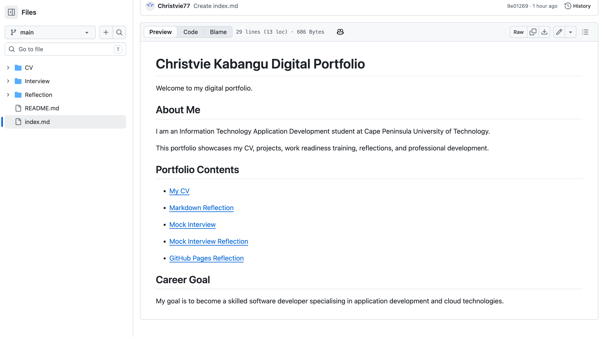
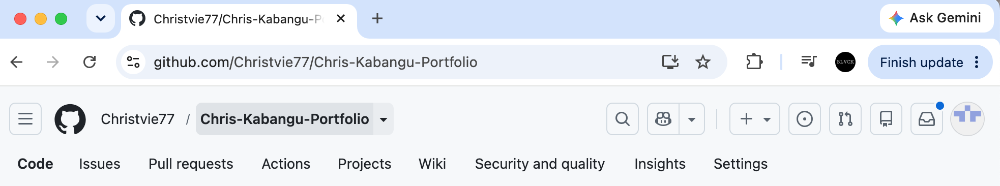
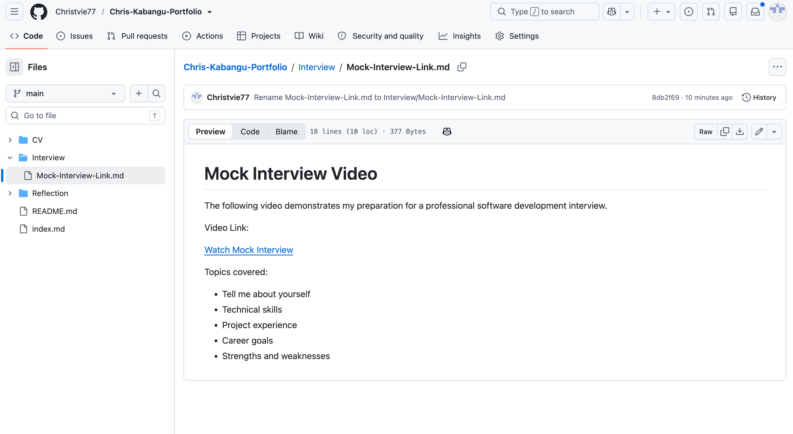
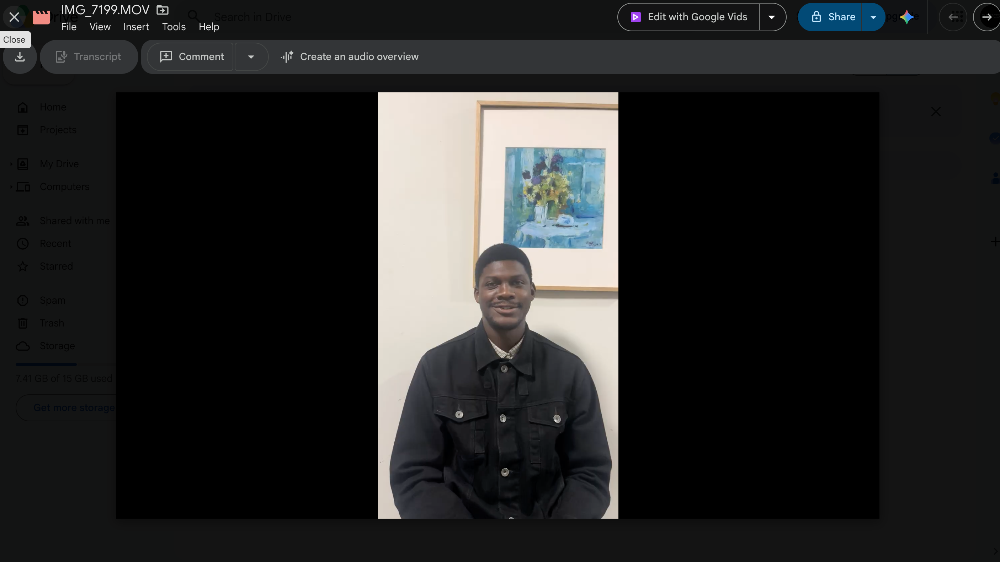

# Christvie Kabangu Digital Portfolio

Welcome to my digital portfolio.

## About Me

I am an Information Technology Application Development student at Cape Peninsula University of Technology.

This portfolio showcases my CV, projects, work readiness training, reflections, and professional development.

## Portfolio Contents

- [My CV](CV.md)

- [Markdown Reflection](Markdown-Reflection.md)

- [Mock Interview](Mock-Interview.md)

- [Mock Interview Reflection](Mock-Interview-Reflection.md)

- [GitHub Pages Reflection](Github-Pages-Reflection.md)

## Career Goal

My goal is to become a skilled software developer specialising in application development and cloud technologies.
# Evidence

## GitHub Student Account

My GitHub account was created using my CPUT student email address.

## GitHub Pages Deployment

My digital portfolio was successfully deployed using GitHub Pages.

## Mock Interview Evidence

My mock interview video demonstrates my professional interview preparation.

